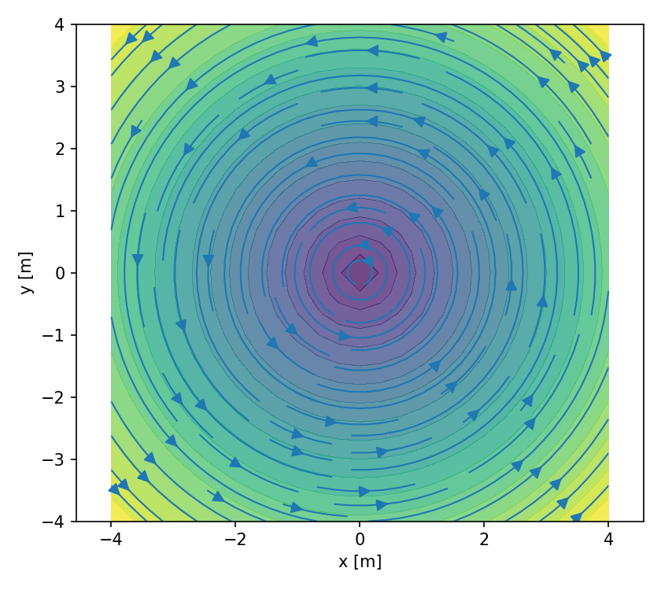
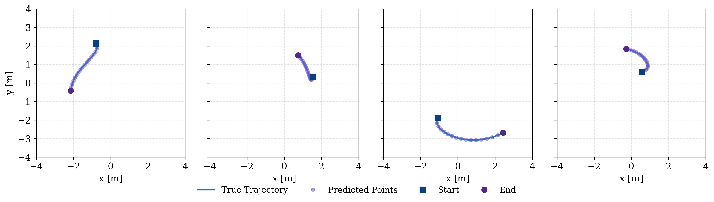
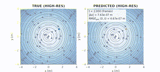
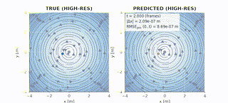

# Floating-Body Hydrodynamics Neural Net (HNN)


[](https://arxiv.org/abs/2509.13783)
[](LICENSE)

> **Physically-structured & interpretable** neural ODE for floating-body dynamics in 2D incompressible flow.  
> This repository provides the implementation of our paper:  
> 📄 [Floating-Body Hydrodynamic Neural Networks (arXiv:2509.13783)](https://arxiv.org/abs/2509.13783)

## 🧪 Evaluation & Visualization

- **Per-second MSE**: position/velocity/overall trajectory errors on test trajectories  
- **GIFs**: `evaluate.render_gif_comparison` shows true vs. predicted trajectories  
- **Flow visualizations**: learned vs. true background flow (quiver + streamplot)  
- **Force decomposition**: `debugtools.debug_decompose_forces` returns interpretable terms (`F_q`, `F_l`, `F_h`, `m_eff`, `a`, etc.)

---

### 🌊 Flow Fields (Model vs. True)

<p align="center">
  
  
  
  
</p>

---

### 🚀 Trajectory Prediction

<p align="center">
  
</p>

---

### 🎥 Example Predictions (GIFs)

<p align="center">
  
  
</p>

---

## ✨ Highlights

- **Incompressible background flow** modeled by a streamfunction ψ(x,y), ensuring divergence-free velocity `u = ∇^⟂ ψ`  
- **Rotation-invariant parameterization**: coefficient networks depend only on `r = ||x||` and `s = ||v_rel||`  
- **Physical constraints**: added-mass and drag coefficients are enforced to be non-negative with upper bounds  
- **Optional smoothness regularization** on flow gradients `||∇u||²`  
- **Interpretability tools**:  
  - Quiver and streamplot visualization of learned flow fields  
  - Force/acceleration decomposition into quadratic drag, linear drag, added mass, hydrodynamic lift, etc.  
- **Evaluation**: trajectory-level train/test split, per-second MSE curves, and **true vs. predicted GIFs**

---

## 🧭 Repository Structure

```
fb_hnn_modular/
├── main.py                     # Entry point: dataset → training → visualization → GIFs → debugging
├── README.md
└── fb_hnn/
    ├── __init__.py
    ├── config.py              # Paths and constants (ρ, A_ref, M_body, tolerance, etc.)
    ├── utils.py               # Save/load parameters, progress bar
    ├── dataio.py              # Dataset generation/loading, trajectory splits, supervised pairs
    ├── physics.py             # Synthetic "true" physical world & rollout_true
    ├── networks.py            # Streamfunction & coefficient networks (rotation-invariant features)
    ├── dynamics.py            # Force decomposition, dynamics, rollout_model, RK4 integrator
    ├── losses.py              # Derivative/timestep loss functions + optional smoothness regularization
    ├── training.py            # Training loop, evaluation, loss/MSE curve plotting
    ├── viz.py                 # Flow field visualization (quiver/streamplot)
    ├── debugtools.py          # Force/acceleration decomposition debugger
    └── evaluate.py            # GIF rendering, evaluation metrics
```

---

## 🛠 Installation

> Recommended: Python 3.10+ virtual environment

```bash
git clone https://github.com/<your-username>/<your-repo>.git
cd <your-repo>

# Basic dependencies (CPU version of JAX)
pip install -U pip
pip install jax jaxlib matplotlib imageio

# For GPU/TPU: please install the correct JAX wheel
# https://github.com/google/jax#installation
```

---

## 🚀 Quick Start

```bash
python main.py
```

This will:
1) Generate a synthetic dataset at `data/fb_dataset.npz` (default: 64 trajectories, T=8s, Δt=0.02s)  
2) Train/evaluate on trajectory splits (default: derivative mode)  
3) Produce outputs:  
   - Training curves: `figures/loss_curve.png`, `figures/sec_mse_curve.png`  
   - Learned flow visualizations: `figures/flow_quiver_best.png`, `figures/flow_stream_best.png`  
   - Ground-truth flow visualizations: `figures/flow_quiver_true.png`, `figures/flow_stream_true.png`  
   - **True vs. predicted GIFs**: `gifs/fb_true_vs_pred_idx*.gif`  
   - Training log: `logs/train_log.txt`  
   - Model checkpoints: `checkpoints/fb_hnn_best.pkl`, `checkpoints/fb_hnn_last.pkl`  

---

## ⚙️ Configurable Parameters

Key options are in `fb_hnn/config.py` and arguments in `main.py`:

- **Physics constants**: `RHO_WATER`, `A_REF`, `M_BODY`  
- **Numerical settings**: ODE tolerance `TOL`, dataset duration `seconds`, subsampling `dt_sub`  
- **Regularization**: `lambda_flow_smooth` (flow-field smoothness)  
- **Coefficient caps**: `CAP_MA`, `CAP_CQ`, `CAP_CL`  
- **Training parameters**:  
  - `num_steps` (default 18000)  
  - `mode="derivative"` or `"timestep"`  
  - `eval_every` (default 200)  
  - `eval_sec_subset` (default 5)  

---

## 🧪 Evaluation & Visualization

- **Per-second MSE** on position/velocity/overall trajectory errors  
- **GIFs**: `evaluate.render_gif_comparison` shows true vs. predicted trajectories  
- **Flow visualizations**: `viz.visualize_flow_field` generates quiver/streamplot plots  
- **Force decomposition**: `debugtools.debug_decompose_forces` returns a dictionary with `F_q`, `F_l`, `F_h`, `m_eff`, `u(x,y)`, `v_rel`, `a`, etc.  

---

## 📰 Paper

- **Title**: [*Floating-Body Hydrodynamic Neural Networks*](https://arxiv.org/abs/2509.13783)  
- **Authors**: Tianshuo Zhang, Wenzhe Zhai, Rui Yann, Jia Gao, He Cao, Xianglei Xing  
- **Submitted**: September 17, 2025  
- **arXiv ID**: 2509.13783  

---

## 🔗 Citation

If you use this repository or model in your research, please cite:

```bibtex
@article{zhang2025floatingbodyhnn,
  title        = {Floating-Body Hydrodynamic Neural Networks},
  author       = {Zhang, Tianshuo and Zhai, Wenzhe and Yann, Rui and Gao, Jia and Cao, He and Xing, Xianglei},
  year         = {2025},
  journal      = {arXiv preprint arXiv:2509.13783},
  url          = {https://arxiv.org/abs/2509.13783}
}
```

---

## 📜 License

MIT License

---

## 🙌 Acknowledgements

- JAX / stax for functional modeling and autodiff  
- Streamfunction-based incompressible flow modeling from classical fluid dynamics  

---
Thanks to the authors of [lagrangian_nns by MilesCranmer et al.](https://github.com/MilesCranmer/lagrangian_nns) for inspiration and foundational ideas that helped guide this work.
**Have fun & make waves 🌊**
